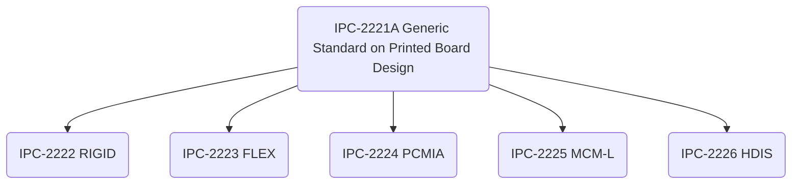

```mermaid
flowchart TD
    Standard-1(IPC-2221A Generic Standard on Printed Board Design) --> Standard-2(IPC-2222 RIGID)
    Standard-1(IPC-2221A Generic Standard on Printed Board Design) --> Standard-3(IPC-2223 FLEX)
    Standard-1(IPC-2221A Generic Standard on Printed Board Design) --> Standard-4(IPC-2224 PCMIA)
    Standard-1(IPC-2221A Generic Standard on Printed Board Design) --> Standard-5(IPC-2225 MCM-L)
    Standard-1(IPC-2221A Generic Standard on Printed Board Design) --> Standard-6(IPC-2226 HDIS)
```