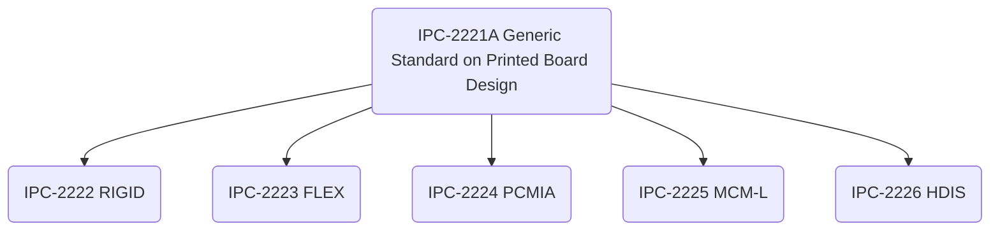

# Introduction

## Scope

This standard establishes the generic requirements for the design of organic printed boards and other forms of component mounting or interconnecting structures. The organic materials may be homogenous, reinforced, or used in combination with inorganic materials; the interconnections may be single, double, or multilayered.

## Documentation Hierarchy

This document is supplemented by various other documents that detail and focus on specific aspects of printed board technology.

Not all supplemental documents are shown. The entire set is called **IPC-2220**, used only for ordering purposes.

## Terminology

Statements including the word **shall** indicate a mandatory provision or requirement, and deviations from these statements can only be considered with data-based justification.

The definition of all terms in IPC-2221A are specified in **ICP-T-50**.

## Product Classification

### Board Type

### Performance Classes

This document establishes three end-product classes to reflect progressive increases in complexity, functional performance requirements and testing/inspection frequency. Equipment may overlap between classes; the designer/user share responsibility to determine the class of their product. Contracts **shall** specify the performance class required and indicate any exceptions to specific parameters as needed.

#### Class 1 General Electronic Products

This class includes:
* consumer products
* some computer equipment and peripherals
* general military hardware where cosmetic imperfections are not important and the major requirement is function of the completed printed board/assembly.

#### Class 2 Dedicated Service Electronic Products

This class includes:
* Communications equipment
* Sophisticated business machines
* Instruments and military equipment

Class 2 products need high performance and extended life. Uninterrupted service is desired but not critical. Certain cosmetic imperfections are allowed.

#### Class 3 High Reliability Electronic Products

This class includes military and commercial products where uninterrupted service/service-on-demand is critical. Downtime is not tolerated; equipment must function when required such as for life support items or weapons systems. Printed boards in this class are suitable for applications where high levels of assurance are required and service is essential.

### Producibility Level

This document defines three design producibility levels addressing features, tolerances, measurements, assembly, verification testing reflecting increasing tool sophistication, materials or processing, and subsequent increases in fabrication cost.

|Level| Description|
|---|---|
|Level A| General Design Producibility (Preferred)|
|Level B| Moderate Design Producibility (Standard)|
|Level C| High Design Producibility (Reduced)|

The levels are a method to communicate the degree of difficulty of a feature between designers and fabrication/assembly facilities. Level selection should always adhere to the minimum need.

# General Requirements

Designing the physical features and selecting the materials for a printed wiring board involves balancing the electrical, mechanical and thermal performance as well as the reliability, manufacturing, and cost of the board. The tradeoff checklist (Table 1) identifies the probable effect of changing each of the features or materials and demonstrates the high-level activity of design tradeoffs.

|Class Abbreviation|Class Name|
|---|---|
|EP|Electrical Performance|
|MP|Mechanical Performance|
|R|Reliability|
|M/Y|Manufacturability/Yield|

|Feature|Class|Parameter|Increased Feature Parameter Impacts|Increased Feature Perf/Rel Impacts|
|---|---|---|---|---|
|Dielectric Thickness to Ground|EP|Lateral Crosstalk|Increased|Degraded|
|Dielectric Thickness to Ground|EP|Vertical Crosstalk|Increased|Degraded|
|Dielectric Thickness to Ground|EP|Characteristic Impedance|Increased|Design-dependent|
|Dielectric Thickness to Ground|MP|Physical Size/Weight|Increased|Degraded|
|Line Spacing|EP|Lateral Crosstalk|Decreased|Enhanced|
|Line Spacing|EP|Vertical Crosstalk|Decreased|Enhanced|
|Line Spacing|MP|Physical Size/Weight|Increased|Degraded|
|Line Spacing|M/Y|Electrical Isolation|Increased|Enhanced|
|Coupled Line Length|EP|Lateral Crosstalk|Increased|Degraded|
|Coupled Line Length|EP|Vertical Crosstalk|Increased|Degraded|
|Line Width|EP|Lateral Crosstalk|Decreased|Enhanced|
|Line Width|EP|Vertical Crosstalk|Increased|Degraded|
|Line Width|EP|Characteristic Impedance|Decreased|Design-dependent|
|Line Width|MP|Physical Size/Weight|Increased|Design-dependent|
|Line Width|R|Signal Conductor Integrity|Increased|Enhanced|
|Line Width|M/Y|Electrical Continuity|Increased|Enhanced|
|Line Thickness|EP|Lateral Crosstalk|Increased|Degraded|
|Line Thickness|R|Signal Conductor Integrity|Increased|Enhanced|
|Vertical Line Spacing|EP|Vertical Crosstalk|Decreased|Enhanced|
|Zo of PCB vs. Zo of Device|EP|Reflections|Decreased|Enhanced|
|Distance between Via Walls|R|Electrical Isolation|Increased|Enhanced|
|Annular Ring (capture and target land to via)| M/Y|Producibility|Increased|Enhanced|
|Signal Layer Quantity|MP|Physical Size/Weight|Increased|Degraded|
|Signal Layer Quantity|M/Y|Layer-to-Layer Registration|Decreased|Degraded|
|Component I/O Pitch Board Thickness|MP|Physical Size/Weight|Increased|Degraded|
|Component I/O Pitch Board Thickness|R|Via Integrity|Decreased|Degraded|
|Component I/O Pitch Board Thickness|M/Y|Via Plating Thickness|Decreased|Degraded|
|Copper Plating Thickness|R|Via Integrity|Increased|Enhanced|
|Aspect Ratio|R|Via Integrity|Decreased|Degraded|
|Aspect Ratio|M/Y|Producibility|Decreased|Degraded|
|Overplate (Nickel-Kevlar only)|R|Via Integrity|Increased|Enhanced|
|Via Diameter|M/Y|Via Plating Thickness|Increased|Enhanced|
|Via Diameter|R|Via Integrity|Increased|Enhanced|
|Laminate Thickness (Core)|EP|Lateral Crosstalk|Increased|Degraded|
|Laminate Thickness (Core)|EP|Vertical Crosstalk|Decreased|Enhanced|
|Laminate Thickness (Core)|EP|Characteristic Impedance|Increased|Design-dependent|
|Laminate Thickness (Core)|MP|Physical Size/Weight|Increased|Degraded|
|Laminate Thickness (Core)|R|Via Integrity|Decreased|Degraded|
|Laminate Thickness (Core)|MP|Flatness Stability|Increased|Enhanced|
|Prepreg Thickness (Core)|EP|Lateral Crosstalk|Increased|Degraded|
|Prepreg Thickness (Core)|EP|Vertical Crosstalk|Decreased|Enhanced|
|Prepreg Thickness (Core)|EP|Characteristic Impedance|Increased|Design-dependent|
|Prepreg Thickness (Core)|EP|Physical Size/Weight|Increased|Degraded|
|Prepreg Thickness (Core)|R|Via Integrity|Decreased|Degraded|
|Dielectric Constant|EP|Reflections|Increased|Degraded|
|Dielectric Constant|EP|Characteristic Impedance|Decreased|Design-dependent|
|Dielectric Constant|EP|Physical Size/Weight|Decreased|Design-dependent|
|CTE (out-of-plane)|R|Via Integrity|Decreased|Degraded|
|CTE (in-plane)|R|Solder Joint Integrity|Decreased|Degraded|
|CTE (in-plane)|R|Signal Conductor Integrity|Decreased|Degraded|
|Resin Tg|R|Via Integrity|Increased|Enhanced|
|Resin Tg|R|PTH Solder Joint Integrity|Increased|Enhanced|
|Copper Ductility|R|Via Integrity|Increased|Enhanced|
|Copper Ductility|R|Signal Conductor Integrity|Decreased|Degraded|
|Copper Peel Strength|R|Component Land Adhesion to Dielectric|Increased|Enhanced|
|Dimensional Stability|M/Y|Layer-to-Layer Registration|Increased|Enhanced|
|Resin Flow|M/Y|PWB Resin Voids|Decreased|Enhanced|
|Rigidity|MP|Flexural Modulus|Increased|Design-dependent|
|Volatile Content|M/Y|PWB Resin Voids|Increased|Degraded|

## Order of Precedence

The order of precedence is:
1. The Contract.
2. The Master drawing or assembly drawing (with an approved deviation list if applicable)/
3. IPC-2221A.
4. Other applicable documents.

## Design Layout

Layout processes should include a formal design review by as many affected disciplines as possible (fabrication, assembly, test). Securing approval from affected disciplines ensures that production-related factors are considered/addressed in the design.

Parameters to consider when creating a design layout:
* environmental conditions (ambient/stored temperature, heat, ventilation, shock, vibration)
* maintainability
* installation interfaces
* testing/fault location
* process allowances (etch factor compensation)
* manufacturing limitations (minimum etched features, plating thickness)
* coating and marking requirements
* assembly technologies (surface mount, through hole, mixed)
* [performance class](#performance-classes)
* material selection
* producibility related to manufacturing limitations:
  * flexibility requirements
  * electrical/electronic
  * performance requirements
* Electrostatic Discharge sensitivity considerations

### End-Product Requirements

The end-product requirements **shall** be known prior to design start-up.

Maintenance and serviceability requirements are important factors which need to be addressed during the design phase, as they can affect layout and conductor routing.

### Density Evaluation

The substrate factors that define the limits of their wire routing ability are:
* Pitch/distance between vias or holes in the substrate
* Number of wires that can be routed between those vias
* Number of signal layers required.

The methods to produce blind and buried vias can facilitate routing by selectively occupying routing channels. Vias that are routed completely through the printed board preclude any use of that space for routing on all conductor layers. These factors can be combined into an equation that defines the wire routing ability of a given technology. Newer technologies such as area array components are more space conservative and allow coarser I/O pitches to be used.

## Schematic/Logic Diagram

The initial schematic/logic diagram designates the electrical functions and interconnectivity provided to the designer for the printed board/assembly. The schematic should define critical circuit layout areas, shielding requirements, grounding and power distribution requirements, the allocation of test points, and any preassigned input/output connectors.

## Parts List

A parts list is a tabulation of parts and materials to construct the printed board assembly. All end item identifiable parts and materials **shall** be identified in the parts list or on the field of the drawing. Excluded are those materials used in the manufacturing process. Reference information such as specifications or the schematic may be listed as well.

All mechanical parts appearing on the assembly drawing **shall** be assigned an iten number matching the number assigned on the parts list.

Electrical components (capacitors, resistors, fuses, ICs, transistors) **shall** be assigned reference designators. These assignments **shall** match those assignments given to the same components on the schematic/logic diagram.

It is advisable to group like items in some sort of ascending or numerical order.

## Test Requirements Considerations

Prior to design start, a testability review should be held with fabrication, assembly, and testing. Testability concerns, such as circuit visibility, density, operation, controllability, partitioning, and special test requirements are discussed as part of the test strategy. See [blank]

During layout, any circuit board changes impacting the test program/tooling should be reported to the proper individuals imeddiately. The testing concept should develop approaches to check the board for problems and detect fault locations wherever possible. The test concept and requirements should economically facilitate the detection, isolation, and correction of faults of the design verification, manufacturing, and field support of the printed board assembly life cycle.

### Printed Board Assembly Testability

Design of a printed board assembly for testability normally involves system-level testability factors. In most applications, contractual requirements (mean time to repair, percent up-time, operate through single faults) necessitate testability features in the system design, and some of these features can increase testability at the printed board assembly level.The integration, testing, and maintenance plans are also factors in testability, e.g. when boards are conformal coated, capabilities of depot and field test equipment, and personnel skill level.

Before design start, system testability requirements should be presented at the conceptual design review. These and any derived requirements should be allocated to the various printed board assemblies. 

The two basic types of printed board assembly test are functional test and in-circuit test (ICT).

Functional testing checks the electrical design functionality. The board is accessed via connector, test points, or bed-of-nails, and tested through pre-determined stimuli (vectors) at the assembly's inputs while monitoring the outputs to ensure the design responds properly.

In-circuit testing checks for manufacturing defects in assemblies. In-circuit testers access the board through bed-of-nails fixturing which contacts each node on the assembly. The assembly is tested by exercising each part individually. In-circuit testing is less design-restrictive. Conformal coated printed assemblies and many Surface Mount Technology (SMT) and mixed techonology printed board assemblies present bed-of-nails physical access problems which may prohibit the use of ICTing. Two primary concerns are:
* the lands/pins must be on grid for compatibility with the use of bed-of-nails, and
* should be accessible from the bottom side

Manufacturing Defects Analyzer (MDA) provide a cost alternative to the regular in-circuit tester. It examines the construction of the assembly for defects. The MDA performs a subset of tests focused on shorts and open faults without power applied to the assembly. For high volume production with highly controlled processes (e.g. Statistical Process Control), the MDA may have application as a viable part of an assembly test strategy.

Vectorless Test is another low cost alternative to ICT. Vectorless performs testing for manufacturing process-related pin faults for SMT boards and does not require vector programming. It is a powered-off measurement technique consisting of three basic types:

1. Analog Junction Test: DC current measurement test on unique pin pairs of the assembly using the ESD protection diodes present on most digital and mixed signal device pins.  
2. RF Induction Test: Magnetic induction tests for device faults utilizing the assemblies devices protection diodes. This technique uses chips power and ground pins to measure and find solder opens on device signal paths, broken bond wires, and devices damaged by ESD. Parts incorrectly oriented can also be detected. Fixturing with inducers are required for this type of test.
3. Capacitive Coupling Test: This technique uses capacitive coupling to test for pin opens and does not rely on internal device circuitry but instead the presence of the metallic lead frame of the device to test the pins. Connectors and sockets, lead frames and correct polarity of capacitors can be tested using this technique.

### Boundary Scan Testing

The boundary scan standard for integrated circuits (IEEE 1149.1 [blank]) provides the means to perform virtual ICT to address assemblies of increasing density (e.g. due to fine pitch devices). Boundary scan architecture is a scan register approach where, at the cost of a few I/O pins and the use of special scan registers in strategic locations throughout the design, the test problem can be simplified to testing of simpler, mostly combinational circuits.

In many applications, adding scan registers to the inputs and outputs of an assembly allows the board to be tested while installed. For more complex circuits, additional scan registers can be added in the design to capture intermediate results and apply test vectors to exercise certain portions.

Boundary Scan testing can be conducted using a low cost PC-based tester which requires access to the printed board assembly under test through the edge connector or an existing functiona, in-circuit, or hybrid test that may be adapted to perform boundary scan testing.

### Functional Test Concern for Printed Board Assemblies

The use of test connectors, problems with initialization and synchronization, long counter chains, self diagnostics, and physical testing are topics which are discussed in detail in the following subsections.

#### Test Connectors

Fault isolation on conformal coating boards or most SMT and mixed technology designs can be difficult due to lack of access to the circuitry. Fault isolation can be improved by placing strategic signals, brought out to a test connector or an area on the board where the signals can be probed (test points). This lowers the cost of detection, isolation, and correction.

The circuit can also be designed so that a test connector stimulates the circuit, such as taking over a data bus, or disables functions on the assembly.

#### Initialization and Synchronization

Some designs do not need initialization circuitry because the circuit quickly cycles into its intended function. In this case, it is difficult to synchronize the tester because it would need programming to stimulate the circuit until a predetermined signature is found on the outputs.

Initialization capability can usually be designed into the circuitry so the assembly can quickly initialize and the circuit and tester can follow the expected outputs.

Free running oscillators also present problems because of synchronization issues with test equipment. Solutions include:  
* adding test circuitry to select a clock instead of the oscillator
* removing the oscillator for test and injecting a test clock
* overriding the signal
* designing the clock system so clocking can be controlled via test connector or test points

#### Long Counter Chains

Long counter chains with signals used from many stages present another testing problem, especially if there is no means to preset the counter chain to different values to enable testing of the logic that is driven from the high order stages.

The counter chain can be broken into smaller chains (no more than 10 stages) or the chain can be loaded via test software, which can then verify the logic operation that is driven from the counter stages without wasting the simulation and test time of completing the entire chain.

#### Self Diagnostics

Self diagnostics are sometimes a contractual or derived requirement. Often an assembly does not contain the functions needed to run self diagnostics, but a set of assemblies can be used for this purpose. A Fast Fourier Transform (FFT) function can be spread across multiple assemblies. The level of self diagnostics required is usually driven by the line replaceable unit (LRU), which depends on requirements.

At the assembly level, there is a test mode to which the assembly applies a known set of test inputs and compares the results with expected responses stored in memory. If the results differ, the assembly signals a test failure.

#### Physical Test Concerns

Assembly test equipment is typically expensive and requires skilled personnel to operate. If testability is poor, testing becomes expensive. Physical considerations can make debugging easier and bring down cost.

Polarized part orientation should be consistent so the operator does not get confused. Nonpolarized parts need to idenity pin #1 so the operator knows which end to probe.

Test connectors are preferable to test points which require test clips or hook-up wires. If using riser leads, for example, to determine a select-by-test resistor, the risers should remain after installation of the selected component to enable verification of the item without any re-fixturing.

Signals which cannot be probed worsen testability and fault isolation. If not using scan registers, every signal should have a land/test point somewhere on the assembly for probing purposes. Lands should be located on grid and positioned such that probing can be done from the secondary side. If probing cannot be afforded to every signal, test vectors need to be increased or other techniques need to be leveraged to assign fault isolation.

Many faults are due to shorts between adjacent part leads, shorts between part leads and external layer conductors, or shorts between conductors. The design must consider these manufacturing defects and not impair the isolation of faults due to signal access issues. Probe pad test points should be on grid for future automated probing.

Design partitioning is sometimes required for electrical performance. Testability is also improved with physical separation of dissimilar functions. Separating/grouping pins on test connectors is one technique. Designs that mix digital design with high performance analog design may require testing on two or more sets of equipment. Signal separation will aid with fixturing and debugging.

Functional test fixturing can be expensive. Most design programs rely on one or a few standard board sizes and thus can reuse fixtures across different assemblies. Test fixtures must be adequately engineered, debugged, and tuned for accuracy, and board designs must account for the restrictions introduced by fixturing:  
1. requiring ground and voltage supplies on specific connector pins
2. limiting which pins can be used for high speed signals
3. limiting which pins can be used for low noise applications
4. defining power switching limitations
5. defining voltage and current limitations on each pin.

### In-Circuit Test Concerns for Printed Board Assemblies

In-circuit testing helps find shorts, opens, wrong or reversed parts, bad devices, incorrect assembly, and other manufacturing defects. In-circuit testing is not intended to find marginal parts or verify critical timing parameters.

In-circuit testing can involve backdriving (see IPC-T-50), which causes devices to oscillate and the tester has insufficient drive to bring the device out of saturation. It can be performed only for controlled periods of time, or the junction of the device (with the overdriven output) will overheat.

The board design should account for ICT fixturing and electrical design considerations, detailed in the following subsections.

#### In-Circuit Test Fixtures

ICT fixtures are commonly called bed-of-nails fixtures, a device with spring contact probes which contact each node on the bard. The following guidelines promote ICT in these fixtures:  
1. diameter of plated-through hole/via test lands are a function of hole size (blank). Diameter of test lands for probing should be no smaller than 0.9mm, but 0.6mm diameter lands are feasible on boards under 7700mm^2.  
2. Test probe site clearances depend on assembly processes. Probe sites should maintain clearance equal to 80% of adjacent component height with a minimum of 0.6mm and a maximum of 5 mm (blank).    
3. Part height on the probe side of the board must not exceed 5.7mm. Taller parts on this side of the board will require cutouts in the test fixture. Test lands should be located 5mm away from tall components, allowing for fixture profiling tolerances during fabrication (blank).  
4. No parts or test lands are to be located within 3mm of board edges.  
5. All probe areas mst be solder coated or covered with a conductive nonoxidizing coating. Test lands must be free of solder resist and markings.  
6. Probe the test lands or vias, not the termination/castellations of leaded parts (blank). Contact pressure can cause an open circuit or make a cold solder joint appear good.  
7. Avoid requiring probing of both sides of the printed board. Use vias, to bring test points to one side, the bottom side (noncomponent or solder side of through-hole technology boards) of the board, allowing for a reliabile and less expensive fixture.  
8. Test lands should be on 2.5mm hole centers, if possible, to allow the use of standard probes and a more reliabile fixture.  
9. Do not rely on edge connector fingers for test lands. Glod plated fingers are easily damaged by probes.  
10. Distribute the test lands evenly over the board area. When the test lands are not evenly distributed or when they are concentrated in one area, the results are board flexing, probing faults, and vacuum sealing problems.  
11. A test land must be provided for all nodes, defined as an electrical connection between two or more components. A test land requires a signal name, the x-y position axis in respect to the board datum point, and a location (which side of the board). This data is requried to build a fixture for SMT and mixed technology board assemblies.  
12. Mixed technology board assemblies and pin grid component boards provide test access for some nodes at the solder side pins. Pins and vias used at t est lands must be identified with node signal name and x-y position in reference to the printed board datum point. use solder mount lands of parts and connectors as test points to reduce the number of generated test lands.  

#### In-Circuit Electrical Considerations

## 3.5.4.2 In-Circuit Electrical Considerations

The following electrical considerations should be followed during printed board assembly layout to promote in-circuit testability:  

1. Do not wire control line pins directly to ground, Vcc, or a common resistor. Disabled control lines on a device can make it impossible to use the standard in-circuit library tests. A specialized test with reduced fault coverage and higher program cost is the normal result.   

2. A single input vector for tri-stating a device’s outputs is preferable for in-circuit testing. Reasons for tri-statable outputs are (1) testers have a limited amount of vectors, (2) the backdrive problems will disappear, and (3) it simplifies the generation of test programs. An example of this which would reduce program cost is tri-statable Programmable Array Logic (PAL) outputs. Use a spare input to a pull-up resistor plus an equation that would enable a normal function in a high state and the device outputs to be tri-stated in a low state.  

3. Gate arrays and devices with high pin counts are not testable using an in-circuit tester. Backdrive may not be a problem per pin but the large numbers of pins limit backdrive restrictions. A control line or a single vector to tri-state all device outputs is recommended.  

4. Node access and the inability to cover all nodes using standard in-circuit testers is a growing problem. If standard test techniques cannot be applied to detect surface mounted part faults, an alternative method must be developed.  

Alternative test strategies must be developed for SMT printed board assemblies with limited nodes. An example of this is a test that will partition the board into groups of clustering components. Each group must have control lines (for testability) and test lands to electrically isolate the cluster from the other devices or groups during test.  

Another alternative test method for opens, shorts, and correct devices is boundary scan. This built-in-test-circuitry (electronic bed-of-nails) is gaining momentum in the surface mount printed board assembly area. IEEE Standard 1149.1 is the specification for boundary scan.  

### Mechanical

#### Uniformity of Connectors

Test fixtures are most often designed for automatic or semiautomatic engagement of edge type or on-board connectors. Connectors should be positioned to facilitate quick engagement and should be uniform and consistent (standardized) in their relationships to the board from one design to another. Similar types of connectors should be keyed, or board geometry used, to ensure proper mating, and prevent electrical damage to the circuitry.

#### Uniformity of Power Distribution Arrangement and Signal Levels on Connectors

The connector contact position should be uniform for AC and DC power levels, DC common and chassis ground, e.g., contact number 1 is always connected to the same relative circuit power point in each board design. Standardizing contact positions will minimize test fixture cost and facilitate diagnostics.  

Signals of widely different magnitude should be isolated to minimize crosstalk.  

Logic levels should be located in pre-designated connector contacts.  

### Electrical

#### Bare Board Testing

Bare board testing shall be performed in accordance with IPC-9252. If testing will use data from the design area, the configuration and type of data provided will be determined by the method of test selected.  

Bare board testing is performed by the printed board supplier and includes continuity, insulation resistance and dielectric withstanding voltage. Suppliers can also perform testing of controlled impedance circuitry. Continuity tests are performed to assure conductors are not broken (opens) or inadvertently connected together (shorts). Insulation resistance and dielectric withstanding voltage testing is performed to assure sufficient conductor spacing and dielectric thickness.  

There are two basic types of continuity testing; Golden Board and Intelligent. In Golden Board test, a known good board is tested and its results are used to test all the remaining boards in the lot. If there were an error in the Golden Board, an error in all boards could go undetected. The Intelligent test verifies each board against the design’s electrical net list. It will not miss the defects which could be undetected in a Golden Board test.  

Designs which do not have all electrical connections available from one side of the board (such as boards with blind or buried vias, components on both sides with via holes solder resist tented or boards bonded to both sides of heatsinks) will require Flip or Clamshell testing. Flip testing tests one side of the board and then the other on two separate fixtures. Connections which require contacting both sides of the board are not evaluated. Clamshell testing uses two fixtures which come in contact with both sides of the board at the same time and is capable of testing all connections. Flip and Clamshell testing costs more than testing performed from one side of the board only.  

The following areas shall be considered before starting a design.  

#### Testing Surface Mount Patterns

Normally, testing of a bare board involves fixturing where spring loaded pins contact plated holes. On a surface mount pattern, the ends of the nets are typically not at holes but rather on surface mount lands. There are at least two different strategies for performing testing:  

A. Contact the via which is connected to the land and visually inspect to ensure continuity from the via to the land. Vias can be designed such that they are on a common grid which will reduce the need for special fixturing for each part number. The barrels of the plated-through holes that are used for internal electrical connectivity should not be subject to probing unless the force is very low and the point of the probe will not damage the barrel. These barrels can crack or break free from the land on the internal layer if subjected to mechanical stresses.  

B. Test to the land itself. This approach will probably require special fixturing since surface mount lands may not all be on a grid. Additionally, computer design systems may place the end-of-net point at a via rather than the land which may require adjustment of test point locations.  

#### Testing of Paired Printed Boards Laminated to a Core

At least two approaches are available for electrical test:   

A. Test the top and bottom of the laminated composite printed board separately. If there are plated holes which provide a side-to-side interconnection, they will require a manual electrical test or visual inspection to ensure hole continuity.  

B. Use a clam shell type fixture where both the top and bottom of the composite printed board can be tested together. The use of the first approach will require that the electrical test data be provided in two parts. When networks have terminations on both sides of the printed board, the electrical test data should be split into at least two parts with the end of net occurring at the side-to-side interconnect. “Self learn” testing from a known good board will provide the data automatically in the above format.  

#### Point of Origin

Electrical test and numerical control data should have a common origin point for ease of constructing electrical test fixtures.  

#### Test Points

When required by the design, test points for probing shall be provided as part of the conductor pattern and shall be identified on the drawing set. Vias, wide conductors, or component lead mounting lands may be considered as probe points provided that sufficient area is available for probing and maintaining the integrity of the via, conductor, or component lead mounting joint. Probe points must be free of nonconductive coating materials such as solder resist or conformal coating.  

## Layout Evaluation

### Board Layout Design

The design layout from one board design to another should be such that designated areas are identified by function, e.g., power supply section confined to one area, analog circuits to another section, and logic circuits to another, etc. This will help to minimize crosstalk, simplify bare board and assembly test fixture design, and facilitate troubleshooting diagnostics. In addition, the design should:  

* Ensure that components have all testable points accessible from the secondary side of the board to facilitate probing with single-sided test fixtures.  
* Have feed-throughs and component holes placed away from board edges to allow adequate test fixture clearance.  
* Require the board be laid out on a grid which matches the design team testing concept.  
* Allow provision for isolating parts of the circuit to facilitate testing and diagnostics.  
* Where practical, group test points and jumper points in the same physical location on the board.  
* Consider high-cost components for socketing so that parts can be easily replaced.  
* Provide optic targets (fiducials) for surface mount designs to allow the use of optic positioning and visual inspection equipment and methods (see blank).  

Surface mounted components and their patterns require special consideration for test probe access, especially if components are mounted on both sides of the board and have very high lead counts.  

#### Layout Concepts

The printed board layout depicts the physical size and location of all electronic and mechanical components, and the routing of conductors that electrically interconnect the components in sufficient detail to allow the preparation of documentation and artwork.  

### Feasibility Density Evaluation

After approved documents for schematic/logic diagrams, parts lists, and end-product and testing requirements are provided, and before the actual drawing of the layout is begun, a feasibility density evaluation should be made. This should be based on the maximum size of all parts required by the parts list and the total space they and their lands will require on the board, exclusive of interconnection conductor routing.  

The total board geometry required for this mounting and termination of the components should then be compared to the total usable board area for this purpose. Reasonable maximum values for this ratio are 70% for Level A, 80% for Level B, and 90% for Level C. Component density values higher than these will be a cause for concern. The lower these values are, the easier it will be to design a cost-effective functional board.  

Figure 3-5 provides the usable board area for the standardized board sizes recommended in Figure 5-1.   

Table 3-2 gives the area (in 0.5 mm [0.020 in] grid elements) a component will occupy on the board for a variety of components. As an example, the 14 lead dual in-line package for through-hole technology occupies a total of 84.0 grid elements. The package outline that encloses the component and land pattern has a grid matrix of 20 x 42 grid elements on 0.5 mm [0.020] centers. The 20 grid elements establish an outline dimension of 10 mm [0.394 in] while the 42 grid elements account for 21 mm [0.827 in]. This component area would use up a portion of the board usable area. The component outline does not include grid elements for conductor routing outside the land area. Total component area compared to total usable area provides the conductor routing availability and thus the density percentage.  

An alternative method of feasibility density evaluation expresses board density in units of square centimeters per equivalent SOIC. A 16-pin SOIC occupies approximately one cm^2 of board area. Figure 3-6 shows a table for determining the SOIC equivalent for a variety of components and the total SOIC equivalents used on the board. This number is divided into the total square centimeters of usable board area. Reasonable maximum density values are 0.55cm^2 per SOIC for Leve A, 0.50 for Level B, and 0.45 for Level C. Density values can increase with additional circuit layers. Also, when using surface mount technology, the potential usable board area is theoretically doubled.  

#### Figure 3-5

|Board Size| Overall Height| Overall Width| Usable Height| Usable Width| Usable Area mm^2| Usable Area Grid Elements 0.5mm Grid|
|-|-|-|-|-|-|-|
|A1|80|60|65|50|3200|12800|
|B1|170|60|155|50|7700|30800|
|C1|260|60|245|50|12200|48800|
|D1|350|60|335|50|16700|66800|
|A2|80|120|65|110|7100|28400|
|B2|170|120|155|110|17000|68000|
|C2|260|120|245|110|26900|107600|
|D2|350|120|335|110|36800|147200|
|A3|80|180|65|170|11000|44000|
|B3|170|180|155|170|26300|105200|
|C3|260|180|245|170|41600|166400|
|D3|350|180|335|170|56900|227600|
|A4|80|240|65|230|14900|59600|
|B4|170|240|155|230|35600|142400|
|C4|260|240|245|230|56300|225200|
|D4|350|240|335|230|77000|308000|  

#### Table 3-2

|Component Description|	Type¹|	Number of Grid Elements² - 0.5 mm [0.20 in] Grid|	Total Grid Elements²|
|-|-|-|-|
|D07 (without stress relief loop)|	THT|	6 × 24|	144|
|D07 (with stress relief loop)|	THT|	6 × 28|	168|
|T05|	THT|	20 × 20|	400|
|T024|	THT|	10 × 10|	100|
|CK05|	THT	|6 × 12|	72|
|CM05, 13000pF|	THT	|20 × 44|	880|
|CM06, 400pF	|THT	|12 × 26|	312|
|RC07	|THT|	6 × 20|	120|
|RC20|	THT|	10 × 26|	260|
|RN60|	THT|	10 × 30|	300|
|CQFP-10 T090|	SMT|	16 × 12|	192|
|CQFP-28|	SMT	|34 × 34|	1156|
|CQFP-144|	SMT	|68 × 68|	4624|
|3216 (1206)|	SMT	|4 × 10	|40|
|4564 (1825)|	SMT	|14 × 12|	168|
|6032|	SMT|	8 × 18|	144|
|DIP-14	|THT|	20 × 42	|840|
|DIP-14	|SMT	|22 × 42	|924|
|DIP-24|	SMT|	22 × 60	|1320|
|DIP-24L	|SMT	|26 × 64|	1664|
|SOD87/MLL-41	|SMT|	6 × 14|	84|
|SOT23|	SMT|	8 × 8|	64|
|SOT89	|SMT	|12 × 10|	120|
|SOT143	|SMT|	8 × 8|	64|
|SQFP 7x7-40|	SMT|	22 × 22|	484|
|SOIC-20W	|SMT|	28 × 24	|672|
|SOIC-36X	|SMT|	48 × 24	|1152|
|TSOP 10×20|	SMT|	22 × 44|	968|
|SOJ 26/350	|SMT	|24 × 34|	816|  

Note 2: Grid area includes physical component outlines and land areas. It does not include space for conductor routing.

## Performance Requirements

Finished printed boards shall meet the performance requirements of IPC-6011 and its applicable sectional specification.

### Figure 3-6

# Materials

## Material Selection

A designer of printed boards has several material choices to consider, ranging from standard to highly sophisticated and specialized. When specifying materials, the designer must first determine what requirements the printed board must meet. These requirements include temperature (soldering and operating), electrical properties, interconnections (soldered components, connectors), structural strength, and circuit density. It should be noted that increased levels of sophistication may lead to increased material and processing costs.  

When constructing a composite from materials with different temperature characteristics, the maximum end-use temperature allowable must be limited to that of the lowest rated material. 

Other items that may be important in the comparison of various materials include: 

* Resin Formula,  
* Flame Resistance,  
* Thermal Stability,  
* Structural Strength,  
* Electrical Properties,  
* Flexural Strength,  
* Maximum Continuous Safe Operating Temperature,  
* Glass Transition Temperature (Tg),  
* Reinforcing Sheet Material,  
* Nonstandard Sizes and Tolerances,  
* Machinability or Punchability,  
* Coefficients of Thermal Expansion (CTE),  
* Dimensional Stability, and  
* Overall Thickness Tolerances.  

### Material Selection for Structural Strength

The first design step in the selection of a laminate is to thoroughly define the service requirements that must be met, i.e., environment, vibration, “G” loadings, shock (impact), physical and electrical requirements.  

The choice of laminate should be made from standard materials to avoid costly and time consuming proof-out tasks. Several laminates may be candidates, and the choice should be optimized to obtain the best balance of properties.  

Materials should be easily available in the form and size required. Special laminate may be costly, and have long lead times. Special laminates should be analyzed against all of the parameters discussed in this section.  

Items to be considered are such things as machining, processing, processing costs, and the overall specification of the raw material.  

In addition to these parameters, the structural strength of the board must be able to withstand the assembly and operational stresses.  

### Material Selection for Electrical Properties

Some of the critical properties to consider are electrical strength, dielectric constant, moisture resistance, and hydrolytic stability. Table 4-1 lists properties of some of the more common systems. Consult the laminate manufacturer utilized by the fabricator for specific values.  

## Material Selection for Environmental Properties

Table 4-2 shows the properties affected by the environment for some of the more common resin systems. The stated values are typical and will vary among different material suppliers. Consult the laminate manufacturer utilized by the fabricator for specific values.  

## Dielectric Base Materials (including Prepregs and Adhesives)

Bonding materials described in the following paragraphs shall be used to bond layers of copper foil, bare laminate, copper clad laminate or heat-sinking planes to each other.  

### Preimpregnated Bonding Layer (Prepeg)

Prepreg shall conform to the types listed in IPC-4101 or UL 746E. In most cases, the prepreg should be of the same resin and reinforcement type as the copper clad laminate. The reinforcement style, nominal resin flow, nominal scaled flow thickness, nominal gel time, and nominal resin content are process parameters normally dictated by the printed board manufacturing process.  

Unless design constraints dictate, these values shall not be included on master drawings, but shall only be specified and used in procurement specifications by the printed board manufacturer.  

### Adhesives

Adhesives used in printed board assemblies are drawn from at least five basic resin types covering a wide range of properties. In addition to adhesion quality or bond strength, criteria for adhesive selection include hardness, coefficient of thermal expansion (CTE), service temperature range, dielectric strength, cure conditions and tendency for outgassing. In some cases structural adhesives may be sufficient for thermal bonding applications, see 4.2.5. Each adhesive type has both strong and weak points. 

Selection of a resin system for an adhesive or encapsulant is to be based on the characteristics of the materials being bonded and their compatibility. Special treatments, such as primers or activators, may be required to suitably activate surfaces for bonding. The selection process should also consider the exact purpose of the adhesive bond and its use environment. Fungus inert materials are also a consideration. Not all adhesives are suitable for direct application on or near electronic products due to either their chemical or dielectric properties. Incorrect selection of materials may result in product degradation or failure.  

In actual application, most adhesive needs can be addressed by a few carefully selected materials. Storage and shelf life limitations apply to most of these materials.  

### Table 4-1

### Table 4-2

#### Epoxies

Epoxy resin formulations are among the most versatile adhesives for electrical insulating and mechanical bonding applications. They offer a wide range of physical and electrical properties, including adhesive and cohesive strengths, hardness, chemical resistance, thermal conductivity and thermal vacuum stability. They are also available with a wide range of cure methods and times. A thorough review of the material is warranted, based on its intended use. Thermal coefficient of expansion and glass transition temperatures should be considered, in addition to other properties, to preclude problems. Epoxies are available with a variety of modifiers, fillers and reinforcements for specific applications and extended temperature ranges.  

#### Silicone Elastomers

Silicone elastomers are generally noted for being resilient materials with very good electrical and mechanical properties at ambient and extreme temperatures. Several curing methods are available, including moisture, metallic salts and others. Silicone elastomers which evolve acetic acid during their cure should be avoided in electronic applications. Bond strength, tensile strength, and hardness properties tend to be considerably lower than epoxies. Silicones will swell and dissolve with prolonged exposure to some chemicals. Some of the metallic salts curing silicones will react with TFE and PTFE materials. Conformal coatings other than silicones generally will not adhere to cured silicone materials. Silicones are often used as a cushioning overcoat for articles which will be encased in hard potting compounds later.  

A number of high purity grades of silicones are available which offer good thermal vacuum stability. Silicone gels are also available, which offer enhanced properties as encapsulants. These materials generally require physical restraint, such as a potting cup or enclosure to maintain their form, once applied.  

#### Acrylics

Acrylic resins generally provide rapid cures, good electrical and adhesive properties and hardness. Chemical resistance and thermal vacuum stability tend to be considerably lower than the epoxies. The glass transition temperature of these materials also tends to be low.  

#### Polyurethanes

Polyurethanes are available in almost as many variations as the epoxies. These materials generally offer toughness, high elasticity, a wide range of hardness, and good adhesion. Some of the urethane compounds are outstanding as vibration and shock damping materials. Moisture and chemical resistance is relatively high, but varies with the individual product. Thermal vacuum stability will also vary by the individual product formulation. Many of the urethanes can be used in a relatively thick application as a local vibration damping compound.  

#### Specialized Acrylate-Based Adhesives

This category includes the cyanoacrylates (instant cure) and anaerobic adhesives (cure without air). The cyanoacrylates form strong bonds within seconds without catalysts when only a trace amount of moisture is present on a surface. The anaerobic adhesives cure in the absence of oxygen when a peroxide additive can be decomposed by certain transition metal ions. Both adhesive types can give high initial bond strengths which may be beneficial for wire staking and temporary bonding applications. The instant cure adhesives generally have poor impact resistance and are susceptible to degradation from exposure to moisture and temperatures over 82 ℃ [179.6 ºF]. The anaerobic adhesives have the capability of withstanding higher temperatures but can lose strength with prolonged exposure to chemicals.  

#### Other Adhesives

Many other types and forms of adhesives are available, including polyesters, polyamides, polyimides, rubber resins, vinyl, hot melts, pressure sensitive, etc. Where they are used is determined by the needs of the design and its performance requirements. Selection of specialized items, such as chip bond adhesives, should be done in conjunction with the using facility, in order to ensure full compatibility of the equipment and process.  

### Adhesive Films or Sheets

Adhesive films or sheets used for bonding heatsinks, stiffeners, etc., or as insulators, are generally in accordance with IPC-4203 or IPC-4101.  

Film type adhesives find many uses in laminated structures. The ability to pre-cut a film adhesive to fit given shapes or dimensions is a distinct advantage in the fabrication of some laminated parts. Epoxy based film adhesives provide very good bond strength but require elevated temperature cure. Film adhesives are commonly used to bond board heatsinks to printed boards.  

Through-hole technology (THT) printed boards and heatsinks may be bonded together with a dry epoxy sheet adhesive to improve heat transfer or resist vibration. These adhesives consist of an epoxy impregnated glass cloth which is cut to the heatsink configuration, assembled between printed board and heatsink, then cured with heat and pressure. The cured adhesive is strong and resists vibration, temperature extremes, and solvents. Thicknesses of 0.1 mm [0.0039 in] should be adequate for most applications. If necessary, specify two sheets.  

### Electrically Conductive Adhesives

This class of adhesives consists, generally, of a conductive filler, such as graphite (carbon) or silver, embedded in a polymeric resin adhesive system, which is loaded into the material to achieve conductivity. Volume resistivity, a measure of the electrically conductive property of the material, may be varied over a range of values consistent with the intended application. This is accomplished by the type of filler used and the loading. Bonding strength of these materials can be compromised by the filler material.  

Epoxies, silicone elastomers and urethanes are the resin systems commonly used to formulate conductive adhesives. The strongest bonds are generally achieved with conductive epoxy. Silicone elastomers follow, with urethanes a close third. Cure conditions and filler content have a pronounced effect upon tensile strength of these materials. The choice of conductive adhesive for a particular application should consider the strength of bond, the service temperature, the effect of CTE on the bond and the volume resistivity or conductivity required.  

### Thermally Conductive/Electrically Insulating Adhesives

Thermally conductive adhesives are filled versions of epoxy, silicone, urethane and some acrylic base materials. The filler is normally dried aluminum oxide or magnesium oxide powder.  

#### Epoxies

The epoxies offer the greatest bond strength and best solvent resistance, along with good thermal conductivity and electrical resistance. As with most two part systems, the choice of catalyst has an impact on cure conditions and ultimately could affect the glass transition temperature, since it is somewhat dependent upon cure conditions.  

#### Silicone Elastomers

The silicone elastomers are characterized by relatively low bond strengths and less rigidity (lower hardness) than epoxies. They are less resistant to solvent attack than epoxy and are two part systems with other variable properties dependent upon formulation. Thermal conductivity and electrical resistance properties are good.  

Silicone elastomers may be obtained as humidity curing or heat curing, the latter offering accelerated cure with applied heat. They cure well in contact with most materials except butyl and chlorinated rubbers, some RTV silicone elastomers and residues of some curing agents. Some bonding applications may require a primer.  

#### Urethanes

Urethanes can be varied through a wide range of hardness, tensile and electrical properties by varying the proportions of curing agent to resin. Consistency can be varied from a soft, rubbery state to a hard, rigid condition by this method. The latitude for formulation optimization over a range of application conditions is an advantage offered by the filled urethanes.  

The urethanes are characterized by relatively low bond strengths and less rigidity (lower hardness) than epoxies. They are less resistant to solvent attack than epoxy; are two part systems with variable other properties dependent upon formulation. Thermal conductivity and electrical resistance properties are good.  

#### Use of Structural Adhesives as Thermal Adhesives

In design circumstances where thermal conduction properties are not critical, the use of structural adhesives (see 4.2.2) in place of thermal adhesives may be acceptable as determined by thermal analysis and may be a more cost effective alternative.  

## Laminate Materials

Laminate materials should be selected from material listed in IPC-4101 or IPC-4202. When Underwriter’s Labs (UL) requirements are imposed, the material used must be approved by UL for use by the printed board manufacturer.  

The board design shall be such that internal temperature rise due to current flow in the conductor, when added to all other sources of heat at the conductor/laminate interface, will not result in an operating temperature in excess of that specified for the laminate material or maximum sustained operating temperature of the assembly.  

Since heat dissipated by parts mounted on the boards will contribute local heating effects, the material selection shall take this factor, plus the equipment’s general internal rise temperature, plus the specified operating ambient temperature for the equipment into account for maximum operating temperature.  

Hot spot temperatures shall not exceed the temperatures specified for the laminate material selected. See IPC-2222 for maximum operating temperature specified for laminate materials. Materials used (copper-clad, prepreg, copper foil, heatsink, etc.) shall be specified on the master drawing.  

### Color Pigmentation

Natural colored stock is preferred, because whenever a pigment is added to change a color, the possibility exists for the pigment to retard the ability of the impregnating resin to completely wet each and every glass fiber. Without complete wetting, moisture can be trapped.  

Colored stock should not be used because the material usually costs more. Production delays may also be incurred because of lack of availability of the colored stock. If colored stock is required, it shall be specified on the procurement documentation.  

### Dielectric Thickness/Spacing

The minimum dielectric thickness/spacing shall be specified on the master drawing.  

## Conductive Materials

The primary function of metallic coatings is to contribute to the formation of the conductive pattern. Beyond this primary function, specific platings offer such additional benefits as corrosion prevention, improved long term solderability, wear resistance, and others.  

The thickness and integrity requirements for metallic platings and coatings on as-produced boards shall be in accordance with the requirements of Table 4-3 for the appropriate class of equipment. Unless otherwise specified on the master drawing, metallic platings and coatings shall meet the requirements specified in 4.4.1 through 4.4.8. Attention should be paid to the effects of dissimilar metals in areas such as connectors, sockets, and other interfaces. The result of a poor material selection could be a reduction in function, either mechanical or electrical.  

### Table 4-3.1

|Code|Finish|Class 1|Class 2|Class 3|
|-|-|-|-|-|
|S|Solder Coating over Bare Copper|Coverage and Solderable(5)|Coverage and Solderable(5)|Coverage and Solderable(5)|
|T|Electrodeposited Tin-Lead (fused) (min)|Coverage and Solderable(5)|Coverage and Solderable(5)|Coverage and Solderable(5)|
|TLU|Electrodeposited Tin-Lead Unfused (min)|8.0 mu-meters|8.0 mu-meters|8.0 mu-meters|
|G|Gold (min) for edge-board connectors and areas not to be soldered|0.8 mu-meters|0.8 mu-meters|1.25 mu-meters|
|GS|Gold (max) on areas to be soldered|0.45 mu-meters|0.45 mu-meters|0.45 mu-meters|
|GWB-1|Gold electroplate for areas to be wire bonded (ultrasonic) (min)|0.05 mu-meters|0.05 mu-meters|0.05 mu-meters|
|GWB-2|Gold Electroplate for areas to be wire bonded (thermosonic) (min)|0.3 mu-meters|0.3 mu-meters|0.8 mu-meters|
|N|Nickel - Electroplate for Edge Board Connectors (min)|2.0 mu-meters|2.5 mu-meters|2.5 mu-meters|
|NB|Nickel - Electroplate as a barrier to Copper-Tin Diffusion(1) (min)|1.3 mu-meters|1.3 mu-meters|1.3 mu-meters|
|OSP|Organic Solderability Preservative|Solderable|Solderable|Solderable|
|ENIG|Electroless Nickel|3 mu-meters (min)|3 mu-meters (min)|3 mu-meters (min)|
|ENIG|Immersion Gold|0.05 mu-meters (min)|0.05 mu-meters (min)|0.05 mu-meters (min)|
|IS|Immersion Silver|Solderable|Solderable|Solderable|
|IT|Immersion Tin|Solderable|Solderable|Solderable|
|C|Bare Copper|blank|blank|blank|

### Table 4.3-2

### Electroless Copper Plating

Electroless copper is deposited on the surface and through holes of the printed board as a result of processing the drilled panel through a series of chemical solutions. Typically, this is the first step in the plating process and is usually 0.6 um to 2.5 um [24 uin to 98.4 pin] thick. Electroless copper can also be used to fully build the required copper thickness, which is referred to as additive plating.  

### Semiconductive Coatings

Semiconductive coatings for direct metallization are used as a conductive starter coating prior to electrolytic copper plating and are applied to the hole wall. The coating should be of sufficient quality for subsequent metallic deposition and shall be non-migrating. This process is typically fabricator dependent and is not specified on the master drawing. Palladium and tin are commonly used materials. A thin layer is deposited on exposed surfaces, especially inside drilled holes. This provides a surface for auto-catalyzing the electroless copper deposition.  

### Electrolytic Copper Plating

Electrolytic copper can be deposited from several different electrolytes, including copper fluoroborate, copper cyanide, copper sulfate, and copper pyrophosphate. Copper sulfate and copper pyrophosphate are the most commonly used electrolytes for building the copper deposition on the surface and through the holes to the required thickness. This type of plating usually produces the final copper thickness requirement.  

### Gold Plating

Deposition may come in 24k soft gold, 23+k hard gold (hardening uses trace amounts of cobalt, nickel, or iron which are co-deposited with the gold), or the plating may be a lower karat alloy (14k-20k) for some applications. Gold plating serves several purposes:  

1. To act as a self lubricating and tarnish resistant contact for edge board connectors. Hard electrolytic gold plating is most often used for this application.  
2. To prevent oxidation of an underlying plating such as nickel and electroless nickel to enhance solderability and extend storage life. Electrolytic, immersion and electroless gold are most often used for this purpose.  
3. To provide a wire bonding surface. This application employs a soft 24k electrolytic gold.  
4. To provide an electrically conductive surface on printed wiring boards when electrically conductive adhesives are used. A minimum thickness of 0.25 um [9.84 uin] is recommended.  
5. To act as an etch resist during printed board fabrication, a minimum thickness of 0.13 um [5.12 uin] is recommended.  
Electrolytically deposited gold is often specified as required to meet ASTM-B-488 with the type and grade selected to satisfy the different applications. A low-stress nickel or electroless nickel shall be used between the gold overplating and the basis metal when gold finish is to be used for electrical or wire bonding.  

Electroless nickel immersion gold plating shall be as specified in IPC-4552.  

### Nickel Plating

Nickel plating serves a dual function in contact plating: 1) It provides an anvil effect under the gold providing an essential extra hardness to the gold; 2) It is an effective barrier layer (when its thickness exceeds 2.5 um [98.4 pin]) which prevents the diffusion of copper into gold. This diffusion process can result in a room temperature alloying of the gold, degrading the electrical and corrosion resistance characteristics of the contact.  

All electrolytically deposited nickel plating shall be low-stress and conform to AMS-QQ-N-290, Class 2, except that the thickness shall be as specified in Table 4-3.  

Reasons for using a nickel underplate include:  

Diffusion Barrier:  
* To inhibit diffusion of copper from the basis metal (and of zinc from brass) to the surface of the precious metal plating.  
* To inhibit interdiffusion between the basis metal and the gold top coat (for example, silver and copper), which might produce a weak alloy or intermetallic compound at the interface.  

Levelling Layer:  
* To produce a smoother surface than the basis metal in order to ensure a lower porosity gold top plate (for example, levelling nickel over a rough substrate).  

Pore Corrosion Inhibitor:  
* A nickel underplate under the gold top coat will form passive oxides at the base of pores in humid air, provided the environment does not contain significant amounts of acidic pollutants (such as SO2 or HCI).  

Tarnish Creepage Inhibitor for Gold:  
* Non-copper base metals will inhibit creepage of copper tarnish films over the gold-where the tarnish originates from pores and bare copper edges.  

Load-Bearing Underlayer for Contacting Surfaces:  
* A hard nickel underplate can serve as a load-bearing foundation for the gold top coat to prevent cracking of hard golds and reduce the wear of the precious metal during sliding of the contacting surfaces. For all these purposes, the nickel underplating must be intact (that is, not cracked) and must have sufficient thickness to achieve the particular function for which it was intended. As a general rule, the minimum thickness should be 1.2 um [47.2 pin], preferably greater. For some levelling purposes, a far greater thickness may be required.  

### Tin/Lead Plating

Tin/Lead Plating is applied in the subtractive fabrication process to provide a copper etch resist and a solderable coating, when required. Typical thickness sufficient for etch resist on 2 oz. copper is 8.0 um, but it is a fabrication process parameter, not a design requirement. The electrodeposit is generally fused by one of several techniques (hot oil immersion, infrared exposure, exposure to hot vapors or inert liquids). The fusing operation results in the formation of a true alloy on the surface and in the through holes of the printed board. Fusing is required unless the unfused option is selected to maintain flatness. It also promotes improved long-term solderability.  

Tin lead plating does not apply to buried plated-through holes which are internal to the printed board and do not extend to the surface.  

Tin-lead plating shall meet the composition requirements of ASTM-B-579.  

#### Tin Plating

Tin Plating is applied in the subtractive fabrication process to provide a copper etch resist.  

### Solder Coating

Solder coating is generally applied by immersing the printed board into molten solder and removing the excess by blowing hot, pressurized air, oil or vapors over the surface of the printed board in a specially designed machine.  

Solder coating does not apply to buried or tented plated-through holes which are internal to the printed board and do not extend to the surface.  

Unless otherwise specified on the master drawing, the solder used for solder coating shall be in accordance with J-STD-006. Solder coating thickness may be specified for particular applications. The performance of solder coating is evaluated, not by a mechanical thickness measurement, but by the ability of the printed board to pass solderability testing per J-STD-003. The user has the responsibility to determine if steam aging, prior to solderability testing, is required.  

### Other Metallic Coatings for Edgeboard Contacts

### Metallic Foil/Film

#### Copper Foil

#### Copper Film

#### Other Foils/Film

#### Metal Core Substrates

### Electronic Component Materials

#### Buried Resistors

#### Buried Capacitors

## Organic Protective Coatings

## Solder Resist (Solder Mask) Coatings

#### Resist Adhesion and Coverage

#### Resist Clearance

### Conformal Coatings

#### Conformal Coating Types and Thickness

### Tarnish Protective Coatings

#### Organic Solderability Protective Coatings

## Marking and Legends

### ESD Considerations

# Mechanical/Physical Properties

## Fabrication Considerations

## Bare Board Fabrication

## Product/Board Configuration

### Board Type

### Board Size

### Board Geometries (Size and Shape)

#### Material Size

### Bow and Twist

### Structural Strength

### Composite (Constraining-Core) Boards

### Vibration Design

## Assembly Requirements

### Mechanical Hardware Attachment

### Part Support

### Assembly and Test

## Dimensioning Systems

### Dimensions and Tolerances

### Component and Feature Location

### Datum Features

#### Datum Features for Palletization

# Electrical Properties

## Electrical Considerations

### Electrical Performance

### Power Distribution Considerations

### Circuit Type Considerations

#### Digital Circuits

#### Analog Circuits

## Conductive Material Requirements

## Electrical Clearance

## B1-Internal Conductors

### B2-External Conductors, Uncoated, Sea Leve to 3050 m [10,007 feet]

### B3-External Conductors, Uncoated, Over 3050 m [10,007 feet]

### B4-External Conductors, with Permanent Polymer Coating (Any Elevation)

### A5-External Conductors, with Conformal Coating Over Assembly (Any Elevation)

### A6-External Component Lead/Termination, Uncoated, Sea Leve to 3050 , [10,007 feet]

### A7-External Component Lead/Termination, with Conformal Coating (Any Elevation)

## Impedance Controls

### Microstrip

### Embedded Microstrip

### Stripline Properties

### Asymmetric Stripline Properties

### Capacitance Considerations

### Inductance Considerations

# Thermal Management

## Cooling Mechanisms

### Conduction

### Radiation

### Convection

### Altitude Effects

## Heat Dissipation Considerations

### Individual Component Heat Dissipation

### Thermal Management Considerations for Board Heatsinks

### Assembly of Heatsinks to Boards

### Special Design Considerations for SMT Board Heatsinks

## Heat Transfer Techniques

### Coefficient of Thermal Expansion (CTE) Characteristics

### Thermal Transfer

### Thermal Matching

## Thermal Design Reliability

# Component and Assembly Issues

## General Replacement Requirements

### Automatic Assembly

#### Board Size

#### Mixed Assemlbies

#### Surface Mounting

### Component Placement

### Orientation

### Accessibility

### Design Envelope

## Component Body Centering

## Mounting Over Conductive Areas

### Clearances

### Physical Support

#### Component Mounting Techniques for Shock and Vibration

#### Class 3 High Reliability Applications

### Heat Dissipation

### Stress Relief

## General Attachment Requirements

### Through-Hole

### Surface Mounting

### Mixed Assemblies

### Soldering Considerations

### Connectors and Interconnects

#### One-Part Connectors

#### Dual In-line Connectors

#### Edge-Board Connectors

#### Two-Part Multiple Connectors

#### Two-Part Discrete-Contact Connectors

#### Edge-Board Adapter Connectors

### Fastening Hardware

### Stiffeners

### Lands for Flattened Round Leads

### Solder Terminals

#### Terminal Mounting-Mechanical

#### Terminal Mounting-Electrical

#### Attachment of Wires/Leads to Terminals

### Eyelets

### Special Wiring

#### Jumper Wires

#### Types

#### Application

### Heat Shrinkabe Devices

### Bus Bar

### Flexible Cable

## Through-Hole Requirements

### Leads Mounted in Through-Holes

#### Straight Through-Hole Mounted Leads

#### Unclinched Leads

#### Clinched Leads

#### Partially Clinched

#### Dual In-line Packages

#### Axial Leaded Components

#### Radial-Lead Components

#### Perpendicular (Vertical) Mounting

#### Flat-Packs

#### Metal Power Packages

## Standard Surface Mount Requirements

### Surface-Mounted Leaded Components

### Flat-Pack Components

### Ribbon Lead Termination

### Round Lead Termination

### Component Lead Sockets

## Fine Pitch SMT (Peripherals)

## Bare Die

### Wire Bond

### Flip Chip

### Chip Scale

## Tape Automated Bonding

## Solderball

# Holes/Interconnections

## General Requirements for Lands with Holes

### Land Requirements

### Annular Ring Requirements

## Holes

### Unsupported Holes

#### Tooling Holes

#### Mounting Holes

### Plated-Through Holes

#### Blind and Buried Vias

#### Thermal Vias

### Location

### Hole Pattern Variation

### Tolerances

#### Hole Location Tolerances

#### Unsupported Holes

#### Plated-Through HOles

### Quantity

### Spacing of Adjacent Holes

### Aspect Ratio

# General Circuit Feature Requirements

## Conductor Characteristics

### Conductor Width and Thickness

### Electrical Clearance

### Conductor Routing

### Conductor Spacing

### Plating Thieves

## Land Characteristics

### Manufacturing Allowances

### Lands for Surface Mounting

### Test Points

### Orientation Symbols

## Large Conductive Areas

# Documentation

## Special Tooling

## Layout

### Viewing

### Accuracy and Scale

### Layout Notes

### Automated-Layout Techniques

## Deviation Requirements

## Phototool Considerations

### Artwork Master Files

### Film Base Material

### Solder Resist Coating Phototools

# Quality Assurance

## Conformance Test Coupons

## Material Quality Assurance

## Conformance Evaluations

### Coupon Quantity and Location

### Coupon Identification

### General Coupon Requirements

#### Toelrances

#### Etched Letters

#### Interlayer Connection Holes

#### Metal Cores

## Individual Coupon Design

## Coupon A and B or A/B (Plated Hole Evaluation, Thermal Stress and Rework Simulation)

### Coupon C (Peel Strength)

### Coupon D (Interconnection Resistance and Continuity)

#### Conformance Testing

#### Process Control

### Coupons E and H (Insulation Resistance)

#### Coupon E

#### Coupon H

### Registration Coupon

#### Coupon F, Conformance Testing (Option 1)

#### Coupon F, Conformance Testing (Option 2)

#### Coupon R, Conformance Testing

### Coupon G (Solder Resist Adhesion)

### Coupon M (Surface Mount Solderability - Optional)

### Coupon N (Peel Strength, Surface Mount Bond Strength - Optional for SMT)

### Coupon S (Hole Solderability - Optional)

### Process Control Test Coupon

### Coupon X (Bending Flexibility and Endurance, Flexible Printed Wiring)

# Appendix A

<ac:structured-macro ac:name="anchor">
  <ac:parameter ac:name="">fig-drsne-meta-model</ac:parameter>
</ac:structured-macro>

<ac:structured-macro ac:name="info">
  <ac:rich-text-body>
    
<strong>Figure 1.</strong> DRS Naval Electronics Meta Model

  </ac:rich-text-body>
</ac:structured-macro>

<ac:image ac:align="center">
  <ri:attachment ri:filename="PDSCDiagramsMetaModel.png"/>
</ac:image>

---

<ac:structured-macro ac:name="anchor">
  <ac:parameter ac:name="">tab-work-instruction-inputs</ac:parameter>
</ac:structured-macro>

<ac:structured-macro ac:name="tip">
  <ac:rich-text-body>
    
<strong>Table 1.</strong> Work Instruction Inputs

  </ac:rich-text-body>
</ac:structured-macro>

# References

|Number|Title|
|---|---|
|IPC-A-22|UL Recognition Test Pattern|
|IPC-A-43|Ten-Layer Multilayer Artwork|
|IPC-A-47|Composite TEst Pattern Ten-Layer Phototool|
|IPC-T-50|Terms and Definitions for Interconnecting and Packaging Electronic Circuits|
|IPC-CF-152|Composite Metallic Material Specification for Printed Wiring Boards|
|IPC-D-279|Design Guidelines for Reliable Surface Mount Technology Printed Board Assemlbies|
|IPC-D-310|Guidelines for Phototool Generation and Measurement Techniques|
|IPC-D-317|Design Guidelines for Electronic Packaging Utilizing High-speed Techniques|
|IPC-D-322|Guidelines for Selecting Printed Wiring Board Sizes Using Standard Panel Sizes|
|IPC-D-325|Documentation Requirements for Printed Boards|
|IPC-D-330|Design Guide Manual|
|IPC-D-356|Bare Substrate Electrical Test Data Format|
|IPC-D-422|Design Guide for Press Fit Rigid Printed Board Backplanes|
|IPC-TM-650|Test Methods Manual
|IPC-CM-770|Printed Board Component Mounting|
|IPC-SM-780|Component Packaging and Interconnecting with Emphasis on Surface Mounting|
|IPC-SM-782|Surface Mount Design and Land Pattern Standard|
|IPC-SM-785|Guidelines for Accelerated Reliability Testing of Surface Mount Solder Attachments|
|IPC-MC-790|Guidelines for Multichip Module Technology Utilization|
|IPC-CC-830|Qualification and Performance of Electrical Insulating Compound for Printed Board|
|IPC-SM-840|Qualification and Performance of Permanent Polymer Coating (Solder Mask) for Printed Boards|
|IPC-2141|Controlled Impedance Circuit Boards and High Speed Logic Design|
|IPC-2511|Generic Requirements for Implementation of Product Manufacturing Description Data and Transfer Methodology|
|IPC-2513|Drawing Methods for Manufacturing Data Description|
|IPC-2514| Printed Board Manufacturing Data Description|
|IPC-2515| Bare Board Product Electrical Testing Data Description|
|IPC-2516|Assembled Board Product Manufacturing|
|IPC-2518| Parts List Product Data Description|
|IPC-4101| Specification for Base Materials for Rigid and Multilayer Printed Boards|
|IPC-4202| Flexible Base Dielectrics for Use in Flexible Printed Circuitry|
|IPC-4203| Adhesive Coated Dielectric Films for Use as Cover Sheets for Flexible Printed Wiring and Flexible Bonding Films|
|IPC-4204| Flexible Metal-Clad Dielectrics for Use in Fabrication of Flexible Printed Circuitry|
|IPC-4552| Specification for Electroless Nickel/Immersion Gold (ENIG) Plating for Printed Circuit Boards|
|IPC-4562| Metal Foil for Printed Wiring Applications|
|IPC-6011| Generic Performance Specification for Printed Boards|
|IPC-6012| Qualification and Performance Specification for Rigid Printed Boards|
|IPC-7095| Design and Assembly Process Implementation for BGAs|
|IPC-9701| Performance Test Methods and Qualification Requirements for Surface Mount Solder Attachments|
|IPC-9252| Guidelines and Requirements for Electrical Testing of Unpopulated Printed Boards|
|SMC-TR-001| An Introduction to Tape Automated Bonding Fine Pitch Technology|
|J-STD-001| Requirements for Soldered Electrical and Electronic Assemlbies|
|J-STD-003| Solderability Tests for Printed Boards|
|J-STD-005| Requirements for Soldering Pastes|
|J-STD-006| Requirements for Electronic Grade Solder Alloys and Fluxed and Non-Fluxed Solid Solders for Electronic Soldering Applications|
|J-STD-012| Implementation of Flip Chip and Chip Scale Technology|
|J-STD-013| Implementation of Ball Grid Array and Other High Density Technology|
|SAE-AMS-QQ-A-250| Aluminum Alloy, Plate, and Sheet|
|SAE-AMS-QQ-N-290| Nickel Plating (Electrodeposited)|
|ASTM-B-152|Copper, Sheet, Strip and Rolled Bar|
|ASTM-B-488| Standard Specification for Electrodeposited Coatings of Gold for Engineering Use|
|ASTM-B-579| Standard Specification for Electrodeposited Coating of Tin-Lead Alloy (Solder Plate)|
|UL-746E| Standard Polymeric Materials, Material used in Printed Wiring Boards|
|IEEE 1149.1| Standard Test Access Port and Boundary-Scan Architecture|
|ANSI/EIA 471| Symbol and Label for Electrostatic Sensitive Devices

# Revision History

# Appendix
