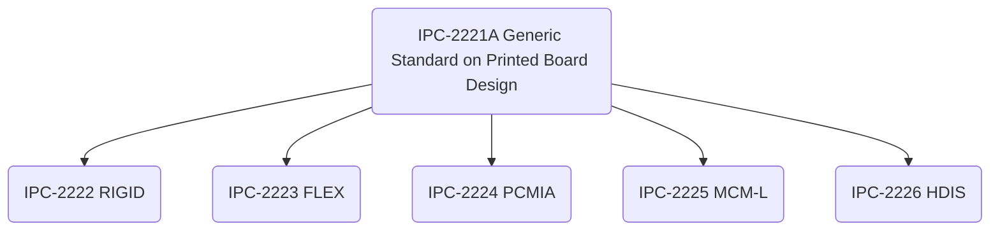

# Introduction

## Scope

This standard establishes the generic requirements for the design of organic printed boards and other forms of component mounting or interconnecting structures. The organic materials may be homogenous, reinforced, or used in combination with inorganic materials; the interconnections may be single, double, or multilayered.

## Documentation Hierarchy

This document is supplemented by various other documents that detail and focus on specific aspects of printed board technology.

Not all supplemental documents are shown. The entire set is called **IPC-2220**, used only for ordering purposes.

## Terminology

Statements including the word **shall** indicate a mandatory provision or requirement, and deviations from these statements can only be considered with data-based justification.

The definition of all terms in IPC-2221A are specified in **ICP-T-50**.

## Product Classification

### Board Type

### Performance Classes

This document establishes three end-product classes to reflect progressive increases in complexity, functional performance requirements and testing/inspection frequency. Equipment may overlap between classes; the designer/user share responsibility to determine the class of their product. Contracts **shall** specify the performance class required and indicate any exceptions to specific parameters as needed.

#### Class 1 General Electronic Products

This class includes:
* consumer products
* some computer equipment and peripherals
* general military hardware where cosmetic imperfections are not important and the major requirement is function of the completed printed board/assembly.

#### Class 2 Dedicated Service Electronic Products

This class includes:
* Communications equipment
* Sophisticated business machines
* Instruments and military equipment

Class 2 products need high performance and extended life. Uninterrupted service is desired but not critical. Certain cosmetic imperfections are allowed.

#### Class 3 High Reliability Electronic Products

This class includes military and commercial products where uninterrupted service/service-on-demand is critical. Downtime is not tolerated; equipment must function when required such as for life support items or weapons systems. Printed boards in this class are suitable for applications where high levels of assurance are required and service is essential.

### Producibility Level

This document defines three design producibility levels addressing features, tolerances, measurements, assembly, verification testing reflecting increasing tool sophistication, materials or processing, and subsequent increases in fabrication cost.

|Level| Description|
|---|---|
|Level A| General Design Producibility (Preferred)|
|Level B| Moderate Design Producibility (Standard)|
|Level C| High Design Producibility (Reduced)|

The levels are a method to communicate the degree of difficulty of a feature between designers and fabrication/assembly facilities. Level selection should always adhere to the minimum need.

# General Requirements

Designing the physical features and selecting the materials for a printed wiring board involves balancing the electrical, mechanical and thermal performance as well as the reliability, manufacturing, and cost of the board. The tradeoff checklist (Table 1) identifies the probable effect of changing each of the features or materials and demonstrates the high-level activity of design tradeoffs.

|Class Abbreviation|Class Name|
|---|---|
|EP|Electrical Performance|
|MP|Mechanical Performance|
|R|Reliability|
|M/Y|Manufacturability/Yield|

|Feature|Class|Parameter|Increased Feature Parameter Impacts|Increased Feature Perf/Rel Impacts|
|---|---|---|---|---|
|Dielectric Thickness to Ground|EP|Lateral Crosstalk|Increased|Degraded|
|Dielectric Thickness to Ground|EP|Vertical Crosstalk|Increased|Degraded|
|Dielectric Thickness to Ground|EP|Characteristic Impedance|Increased|Design-dependent|
|Dielectric Thickness to Ground|MP|Physical Size/Weight|Increased|Degraded|
|Line Spacing|EP|Lateral Crosstalk|Decreased|Enhanced|
|Line Spacing|EP|Vertical Crosstalk|Decreased|Enhanced|
|Line Spacing|MP|Physical Size/Weight|Increased|Degraded|
|Line Spacing|M/Y|Electrical Isolation|Increased|Enhanced|
|Coupled Line Length|EP|Lateral Crosstalk|Increased|Degraded|
|Coupled Line Length|EP|Vertical Crosstalk|Increased|Degraded|
|Line Width|EP|Lateral Crosstalk|Decreased|Enhanced|
|Line Width|EP|Vertical Crosstalk|Increased|Degraded|
|Line Width|EP|Characteristic Impedance|Decreased|Design-dependent|
|Line Width|MP|Physical Size/Weight|Increased|Design-dependent|
|Line Width|R|Signal Conductor Integrity|Increased|Enhanced|
|Line Width|M/Y|Electrical Continuity|Increased|Enhanced|
|Line Thickness|EP|Lateral Crosstalk|Increased|Degraded|
|Line Thickness|R|Signal Conductor Integrity|Increased|Enhanced|
|Vertical Line Spacing|EP|Vertical Crosstalk|Decreased|Enhanced|
|Zo of PCB vs. Zo of Device|EP|Reflections|Decreased|Enhanced|
|Distance between Via Walls|R|Electrical Isolation|Increased|Enhanced|
|Annular Ring (capture and target land to via)| M/Y|Producibility|Increased|Enhanced|
|Signal Layer Quantity|MP|Physical Size/Weight|Increased|Degraded|
|Signal Layer Quantity|M/Y|Layer-to-Layer Registration|Decreased|Degraded|
|Component I/O Pitch Board Thickness|MP|Physical Size/Weight|Increased|Degraded|
|Component I/O Pitch Board Thickness|R|Via Integrity|Decreased|Degraded|
|Component I/O Pitch Board Thickness|M/Y|Via Plating Thickness|Decreased|Degraded|
|Copper Plating Thickness|R|Via Integrity|Increased|Enhanced|
|Aspect Ratio|R|Via Integrity|Decreased|Degraded|
|Aspect Ratio|M/Y|Producibility|Decreased|Degraded|
|Overplate (Nickel-Kevlar only)|R|Via Integrity|Increased|Enhanced|
|Via Diameter|M/Y|Via Plating Thickness|Increased|Enhanced|
|Via Diameter|R|Via Integrity|Increased|Enhanced|
|Laminate Thickness (Core)|EP|Lateral Crosstalk|Increased|Degraded|
|Laminate Thickness (Core)|EP|Vertical Crosstalk|Decreased|Enhanced|
|Laminate Thickness (Core)|EP|Characteristic Impedance|Increased|Design-dependent|
|Laminate Thickness (Core)|MP|Physical Size/Weight|Increased|Degraded|
|Laminate Thickness (Core)|R|Via Integrity|Decreased|Degraded|
|Laminate Thickness (Core)|MP|Flatness Stability|Increased|Enhanced|
|Prepreg Thickness (Core)|EP|Lateral Crosstalk|Increased|Degraded|
|Prepreg Thickness (Core)|EP|Vertical Crosstalk|Decreased|Enhanced|
|Prepreg Thickness (Core)|EP|Characteristic Impedance|Increased|Design-dependent|
|Prepreg Thickness (Core)|EP|Physical Size/Weight|Increased|Degraded|
|Prepreg Thickness (Core)|R|Via Integrity|Decreased|Degraded|
|Dielectric Constant|EP|Reflections|Increased|Degraded|
|Dielectric Constant|EP|Characteristic Impedance|Decreased|Design-dependent|
|Dielectric Constant|EP|Physical Size/Weight|Decreased|Design-dependent|
|CTE (out-of-plane)|R|Via Integrity|Decreased|Degraded|
|CTE (in-plane)|R|Solder Joint Integrity|Decreased|Degraded|
|CTE (in-plane)|R|Signal Conductor Integrity|Decreased|Degraded|
|Resin Tg|R|Via Integrity|Increased|Enhanced|
|Resin Tg|R|PTH Solder Joint Integrity|Increased|Enhanced|
|Copper Ductility|R|Via Integrity|Increased|Enhanced|
|Copper Ductility|R|Signal Conductor Integrity|Decreased|Degraded|
|Copper Peel Strength|R|Component Land Adhesion to Dielectric|Increased|Enhanced|
|Dimensional Stability|M/Y|Layer-to-Layer Registration|Increased|Enhanced|
|Resin Flow|M/Y|PWB Resin Voids|Decreased|Enhanced|
|Rigidity|MP|Flexural Modulus|Increased|Design-dependent|
|Volatile Content|M/Y|PWB Resin Voids|Increased|Degraded|

## Order of Precedence

The order of precedence is:
1. The Contract.
2. The Master drawing or assembly drawing (with an approved deviation list if applicable)/
3. IPC-2221A.
4. Other applicable documents.

## Design Layout

Layout processes should include a formal design review by as many affected disciplines as possible (fabrication, assembly, test). Securing approval from affected disciplines ensures that production-related factors are considered/addressed in the design.

Parameters to consider when creating a design layout:
* environmental conditions (ambient/stored temperature, heat, ventilation, shock, vibration)
* maintainability
* installation interfaces
* testing/fault location
* process allowances (etch factor compensation)
* manufacturing limitations (minimum etched features, plating thickness)
* coating and marking requirements
* assembly technologies (surface mount, through hole, mixed)
* [performance class](#performance-classes)
* material selection
* producibility related to manufacturing limitations:
  * flexibility requirements
  * electrical/electronic
  * performance requirements
* Electrostatic Discharge sensitivity considerations

### End-Product Requirements

The end-product requirements **shall** be known prior to design start-up.

Maintenance and serviceability requirements are important factors which need to be addressed during the design phase, as they can affect layout and conductor routing.

### Density Evaluation

The substrate factors that define the limits of their wire routing ability are:
* Pitch/distance between vias or holes in the substrate
* Number of wires that can be routed between those vias
* Number of signal layers required.

The methods to produce blind and buried vias can facilitate routing by selectively occupying routing channels. Vias that are routed completely through the printed board preclude any use of that space for routing on all conductor layers. These factors can be combined into an equation that defines the wire routing ability of a given technology. Newer technologies such as area array components are more space conservative and allow coarser I/O pitches to be used.

## Schematic/Logic Diagram

The initial schematic/logic diagram designates the electrical functions and interconnectivity provided to the designer for the printed board/assembly. The schematic should define critical circuit layout areas, shielding requirements, grounding and power distribution requirements, the allocation of test points, and any preassigned input/output connectors.

## Parts List

A parts list is a tabulation of parts and materials to construct the printed board assembly. All end item identifiable parts and materials **shall** be identified in the parts list or on the field of the drawing. Excluded are those materials used in the manufacturing process. Reference information such as specifications or the schematic may be listed as well.

All mechanical parts appearing on the assembly drawing **shall** be assigned an iten number matching the number assigned on the parts list.

Electrical components (capacitors, resistors, fuses, ICs, transistors) **shall** be assigned reference designators. These assignments **shall** match those assignments given to the same components on the schematic/logic diagram.

It is advisable to group like items in some sort of ascending or numerical order.

## Test Requirements Considerations

Prior to design start, a testability review should be held with fabrication, assembly, and testing. Testability concerns, such as circuit visibility, density, operation, controllability, partitioning, and special test requirements are discussed as part of the test strategy. See [blank]

During layout, any circuit board changes impacting the test program/tooling should be reported to the proper individuals imeddiately. The testing concept should develop approaches to check the board for problems and detect fault locations wherever possible. The test concept and requirements should economically facilitate the detection, isolation, and correction of faults of the design verification, manufacturing, and field support of the printed board assembly life cycle.

### Printed Board Assembly Testability

Design of a printed board assembly for testability normally involves system-level testability factors. In most applications, contractual requirements (mean time to repair, percent up-time, operate through single faults) necessitate testability features in the system design, and some of these features can increase testability at the printed board assembly level.The integration, testing, and maintenance plans are also factors in testability, e.g. when boards are conformal coated, capabilities of depot and field test equipment, and personnel skill level.

Before design start, system testability requirements should be presented at the conceptual design review. These and any derived requirements should be allocated to the various printed board assemblies. 

The two basic types of printed board assembly test are functional test and in-circuit test.

Functional testing checks the electrical design functionality. The board is accessed via connector, test points, or bed-of-nails, and tested through pre-determined stimuli (vectors) at the assembly's inputs while monitoring the outputs to ensure the design responds properly.

In-circuit testing checks for manufacturing defects in assemblies. In-circuit testers access the board through bed-of-nails fixturing which contacts each node on the assembly. The assembly is tested by exercising each part individually. In-circuit testing is less design-restrictive. Conformal coated printed assemblies and many Surface Mount Technology (SMT) and mixed techonology printed board assemblies present bed-of-nails physical access problems which may prohibit the use of in-circuit testing. Two primary concerns are:
* the lands/pins must be on grid for compatibility with the use of bed-of-nails, and
* should be accessible from the bottom side

Manufacturing Defects Analyzer (MDA) provide a cost alternative to the regular in-circuit tester. It examines the construction of the assembly for defects. The MDA performs a subset of tests focused on shorts and open faults without power applied to the assembly. For high volume production with highly controlled processes (e.g. Statistical Process Control), the MDA may have application as a viable part of an assembly test strategy.

Vectorless Test is another low cost alternative to in-circuit testing. Vectorless performs testing for manufacturing process-related pin faults for SMT boards and does not require vector programming. It is a powered-off measurement technique consisting of three basic types:

1. Analog Junction Test: DC current measurement test on unique pin pairs of the assembly using the ESD protection diodes present on most digital and mixed signal device pins.  
2. RF Induction Test: Magnetic induction tests for device faults utilizing the assemblies devices protection diodes. This technique uses chips power and ground pins to measure and find solder opens on device signal paths, broken bond wires, and devices damaged by ESD. Parts incorrectly oriented can also be detected. Fixturing with inducers are required for this type of test.
3. Capacitive Coupling Test: This technique uses capacitive coupling to test for pin opens and does not rely on internal device circuitry but instead the presence of the metallic lead frame of the device to test the pins. Connectors and sockets, lead frames and correct polarity of capacitors can be tested using this technique.

### Boundary Scan Testing

The boundary scan standard for integrated circuits (IEEE 1149.1 [blank]) provides the means to perform virtual in-circuit testing to address assemblies of increasing density (e.g. due to fine pitch devices). Boundary scan architecture is a scan register approach where, at the cost of a few I/O pins and the use of special scan registers in strategic locations throughout the design, the test problem can be simplified to testing of simpler, mostly combinational circuits.

In many applications, adding scan registers to the inputs and outputs of an assembly allows the board to be tested while installed. For more complex circuits, additional scan registers can be added in the design to capture intermediate results and apply test vectors to exercise certain portions.

### Functional Test Concern for Printed Board Assemblies

#### Test Connectors

#### Initialization and Synchronization

#### Long Counter Chains

#### Self Diagnostics

#### Physical Test Concerns

### In-Circuit Test Concerns for Printed Board Assemblies

#### In-Circuit Test Fixtures

#### In-Circuit Electrical Considerations

### Mechanical

#### Uniformity of Connectors

#### Uniformity of Power Distribution Arrangement and Signal Levels on Connectors

### Electrical

#### Bare Board Testing

#### Testing Surface Mount Patterns

#### Testing of Paired Printed Boards Laminated to a Core

#### Point of Origin

#### Test Points

## Layout Evaluation

### Board Layout Design

#### Layout Concepts

### Feasibility Density Evaluation

# Materials

## Material Selection

### Material Selection for Structural Strength

### Material Selection for Electrical Properties

## Material Selection for Environmental Properties

## Dielectric Base Materials (including Prepregs and Adhesives)

### Preimpregnated Bonding Layer (Prepeg)

### Adhesives

#### Epoxies

#### Silicone Elastomers

#### Acrylics

#### Polyurethanes

#### Specialized Acrylate-Based Adhesives

#### Other Adhesives

### Adhesive FIlms or Sheets

### Electrically Conductive Adhesives

### Thermally Conductive/Electrically Insulating Adhesives

#### Epoxies

#### Silicone Elastomers

#### Urethanes

#### Use of Structural Adhesives as Thermal Adhesives

## Laminate Materials

### Color Pigmentation

### Dielectric Thickness/Spacing

## Conductive Materials

### Electroless Copper Plating

### Semiconductive Coatings

### Electrolytic Copper Plating

### Gold Plating

### Nickel Plating

### Tin/Lead Plating

#### Tin Plating

### Solder Coating

### Other Metallic Coatings for Edgeboard Contacts

### Metallic Foil/Film

#### Copper Foil

#### Copper Film

#### Other Foils/Film

#### Metal Core Substrates

### Electronic Component Materials

#### Buried Resistors

#### Buried Capacitors

## Organic Protective Coatings

## Solder Resist (Solder Mask) Coatings

#### Resist Adhesion and Coverage

#### Resist Clearance

### Conformal Coatings

#### Conformal Coating Types and Thickness

### Tarnish Protective Coatings

#### Organic Solderability Protective Coatings

## Marking and Legends

### ESD Considerations

# Mechanical/Physical Properties

## Fabrication Considerations

## Bare Board Fabrication

## Product/Board Configuration

### Board Type

### Board Size

### Board Geometries (Size and Shape)

#### Material Size

### Bow and Twist

### Structural Strength

### Composite (Constraining-Core) Boards

### Vibration Design

## Assembly Requirements

### Mechanical Hardware Attachment

### Part Support

### Assembly and Test

## Dimensioning Systems

### Dimensions and Tolerances

### Component and Feature Location

### Datum Features

#### Datum Features for Palletization

# Electrical Properties

## Electrical Considerations

### Electrical Performance

### Power Distribution Considerations

### Circuit Type Considerations

#### Digital Circuits

#### Analog Circuits

## Conductive Material Requirements

## Electrical Clearance

## B1-Internal Conductors

### B2-External Conductors, Uncoated, Sea Leve to 3050 m [10,007 feet]

### B3-External Conductors, Uncoated, Over 3050 m [10,007 feet]

### B4-External Conductors, with Permanent Polymer Coating (Any Elevation)

### A5-External Conductors, with Conformal Coating Over Assembly (Any Elevation)

### A6-External Component Lead/Termination, Uncoated, Sea Leve to 3050 , [10,007 feet]

### A7-External Component Lead/Termination, with Conformal Coating (Any Elevation)

## Impedance Controls

### Microstrip

### Embedded Microstrip

### Stripline Properties

### Asymmetric Stripline Properties

### Capacitance Considerations

### Inductance Considerations

# Thermal Management

## Cooling Mechanisms

### Conduction

### Radiation

### Convection

### Altitude Effects

## Heat Dissipation Considerations

### Individual Component Heat Dissipation

### Thermal Management Considerations for Board Heatsinks

### Assembly of Heatsinks to Boards

### Special Design Considerations for SMT Board Heatsinks

## Heat Transfer Techniques

### Coefficient of Thermal Expansion (CTE) Characteristics

### Thermal Transfer

### Thermal Matching

## Thermal Design Reliability

# Component and Assembly Issues

## General Replacement Requirements

### Automatic Assembly

#### Board Size

#### Mixed Assemlbies

#### Surface Mounting

### Component Placement

### Orientation

### Accessibility

### Design Envelope

## Component Body Centering

## Mounting Over Conductive Areas

### Clearances

### Physical Support

#### Component Mounting Techniques for Shock and Vibration

#### Class 3 High Reliability Applications

### Heat Dissipation

### Stress Relief

## General Attachment Requirements

### Through-Hole

### Surface Mounting

### Mixed Assemblies

### Soldering Considerations

### Connectors and Interconnects

#### One-Part Connectors

#### Dual In-line Connectors

#### Edge-Board Connectors

#### Two-Part Multiple Connectors

#### Two-Part Discrete-Contact Connectors

#### Edge-Board Adapter Connectors

### Fastening Hardware

### Stiffeners

### Lands for Flattened Round Leads

### Solder Terminals

#### Terminal Mounting-Mechanical

#### Terminal Mounting-Electrical

#### Attachment of Wires/Leads to Terminals

### Eyelets

### Special Wiring

#### Jumper Wires

#### Types

#### Application

### Heat Shrinkabe Devices

### Bus Bar

### Flexible Cable

## Through-Hole Requirements

### Leads Mounted in Through-Holes

#### Straight Through-Hole Mounted Leads

#### Unclinched Leads

#### Clinched Leads

#### Partially Clinched

#### Dual In-line Packages

#### Axial Leaded Components

#### Radial-Lead Components

#### Perpendicular (Vertical) Mounting

#### Flat-Packs

#### Metal Power Packages

## Standard Surface Mount Requirements

### Surface-Mounted Leaded Components

### Flat-Pack Components

### Ribbon Lead Termination

### Round Lead Termination

### Component Lead Sockets

## Fine Pitch SMT (Peripherals)

## Bare Die

### Wire Bond

### Flip Chip

### Chip Scale

## Tape Automated Bonding

## Solderball

# Holes/Interconnections

## General Requirements for Lands with Holes

### Land Requirements

### Annular Ring Requirements

## Holes

### Unsupported Holes

#### Tooling Holes

#### Mounting Holes

### Plated-Through Holes

#### Blind and Buried Vias

#### Thermal Vias

### Location

### Hole Pattern Variation

### Tolerances

#### Hole Location Tolerances

#### Unsupported Holes

#### Plated-Through HOles

### Quantity

### Spacing of Adjacent Holes

### Aspect Ratio

# General Circuit Feature Requirements

## Conductor Characteristics

### Conductor Width and Thickness

### Electrical Clearance

### Conductor Routing

### Conductor Spacing

### Plating Thieves

## Land Characteristics

### Manufacturing Allowances

### Lands for Surface Mounting

### Test Points

### Orientation Symbols

## Large Conductive Areas

# Documentation

## Special Tooling

## Layout

### Viewing

### Accuracy and Scale

### Layout Notes

### Automated-Layout Techniques

## Deviation Requirements

## Phototool Considerations

### Artwork Master Files

### Film Base Material

### Solder Resist Coating Phototools

# Quality Assurance

## Conformance Test Coupons

## Material Quality Assurance

## Conformance Evaluations

### Coupon Quantity and Location

### Coupon Identification

### General Coupon Requirements

#### Toelrances

#### Etched Letters

#### Interlayer Connection Holes

#### Metal Cores

## Individual Coupon Design

## Coupon A and B or A/B (Plated Hole Evaluation, Thermal Stress and Rework Simulation)

### Coupon C (Peel Strength)

### Coupon D (Interconnection Resistance and Continuity)

#### Conformance Testing

#### Process Control

### Coupons E and H (Insulation Resistance)

#### Coupon E

#### Coupon H

### Registration Coupon

#### Coupon F, Conformance Testing (Option 2)

#### Coupon R, Conformance Testing

<ac:structured-macro ac:name="anchor">
  <ac:parameter ac:name="">fig-drsne-meta-model</ac:parameter>
</ac:structured-macro>

<ac:structured-macro ac:name="info">
  <ac:rich-text-body>
    
<strong>Figure 1.</strong> DRS Naval Electronics Meta Model

  </ac:rich-text-body>
</ac:structured-macro>

<ac:image ac:align="center">
  <ri:attachment ri:filename="PDSCDiagramsMetaModel.png"/>
</ac:image>

---

<ac:structured-macro ac:name="anchor">
  <ac:parameter ac:name="">tab-work-instruction-inputs</ac:parameter>
</ac:structured-macro>

<ac:structured-macro ac:name="tip">
  <ac:rich-text-body>
    
<strong>Table 1.</strong> Work Instruction Inputs

  </ac:rich-text-body>
</ac:structured-macro>

# References

|Number|Title|
|---|---|
|IPC-A-22|UL Recognition Test Pattern|
|IPC-A-43|Ten-Layer Multilayer Artwork|
|IPC-A-47|Composite TEst Pattern Ten-Layer Phototool|
|IPC-T-50|Terms and Definitions for Interconnecting and Packaging Electronic Circuits|
|IPC-CF-152|Composite Metallic Material Specification for Printed Wiring Boards|
|IPC-D-279|Design Guidelines for Reliable Surface Mount Technology Printed Board Assemlbies|
|IPC-D-310|Guidelines for Phototool Generation and Measurement Techniques|
|IPC-D-317|Design Guidelines for Electronic Packaging Utilizing High-speed Techniques|
|IPC-D-322|Guidelines for Selecting Printed Wiring Board Sizes Using Standard Panel Sizes|
|IPC-D-325|Documentation Requirements for Printed Boards|
|IPC-D-330|Design Guide Manual|
|IPC-D-356|Bare Substrate Electrical Test Data Format|
|IPC-D-422|Design Guide for Press Fit Rigid Printed Board Backplanes|
|IPC-TM-650|Test Methods Manual
|IPC-CM-770|Printed Board Component Mounting|
|IPC-SM-780|Component Packaging and Interconnecting with Emphasis on Surface Mounting|
|IPC-SM-782|Surface Mount Design and Land Pattern Standard|
|IPC-SM-785|Guidelines for Accelerated Reliability Testing of Surface Mount Solder Attachments|
|IPC-MC-790|Guidelines for Multichip Module Technology Utilization|
|IPC-CC-830|Qualification and Performance of Electrical Insulating Compound for Printed Board|
|IPC-SM-840|Qualification and Performance of Permanent Polymer Coating (Solder Mask) for Printed Boards|
|IPC-2141|Controlled Impedance Circuit Boards and High Speed Logic Design|
|IPC-2511|Generic Requirements for Implementation of Product Manufacturing Description Data and Transfer Methodology|
|IPC-2513|Drawing Methods for Manufacturing Data Description|
|IPC-2514| Printed Board Manufacturing Data Description|
|IPC-2515| Bare Board Product Electrical Testing Data Description|
|IPC-2516|Assembled Board Product Manufacturing|
|IPC-2518| Parts List Product Data Description|
|IPC-4101| Specification for Base Materials for Rigid and Multilayer Printed Boards|
|IPC-4202| Flexible Base Dielectrics for Use in Flexible Printed Circuitry|
|IPC-4203| Adhesive Coated Dielectric Films for Use as Cover Sheets for Flexible Printed Wiring and Flexible Bonding Films|
|IPC-4204| Flexible Metal-Clad Dielectrics for Use in Fabrication of Flexible Printed Circuitry|
|IPC-4552| Specification for Electroless Nickel/Immersion Gold (ENIG) Plating for Printed Circuit Boards|
|IPC-4562| Metal Foil for Printed Wiring Applications|
|IPC-6011| Generic Performance Specification for Printed Boards|
|IPC-6012| Qualification and Performance Specification for Rigid Printed Boards|
|IPC-7095| Design and Assembly Process Implementation for BGAs|
|IPC-9701| Performance Test Methods and Qualification Requirements for Surface Mount Solder Attachments|
|IPC-9252| Guidelines and Requirements for Electrical Testing of Unpopulated Printed Boards|
|SMC-TR-001| An Introduction to Tape Automated Bonding Fine Pitch Technology|
|J-STD-001| Requirements for Soldered Electrical and Electronic Assemlbies|
|J-STD-003| Solderability Tests for Printed Boards|
|J-STD-005| Requirements for Soldering Pastes|
|J-STD-006| Requirements for Electronic Grade Solder Alloys and Fluxed and Non-Fluxed Solid Solders for Electronic Soldering Applications|
|J-STD-012| Implementation of Flip Chip and Chip Scale Technology|
|J-STD-013| Implementation of Ball Grid Array and Other High Density Technology|
|SAE-AMS-QQ-A-250| Aluminum Alloy, Plate, and Sheet|
|SAE-AMS-QQ-N-290| Nickel Plating (Electrodeposited)|
|ASTM-B-152|Copper, Sheet, Strip and Rolled Bar|
|ASTM-B-488| Standard Specification for Electrodeposited Coatings of Gold for Engineering Use|
|ASTM-B-579| Standard Specification for Electrodeposited Coating of Tin-Lead Alloy (Solder Plate)|
|UL-746E| Standard Polymeric Materials, Material used in Printed Wiring Boards|
|IEEE 1149.1| Standard Test Access Port and Boundary-Scan Architecture|
|ANSI/EIA 471| Symbol and Label for Electrostatic Sensitive Devices

# Revision History

# Appendix